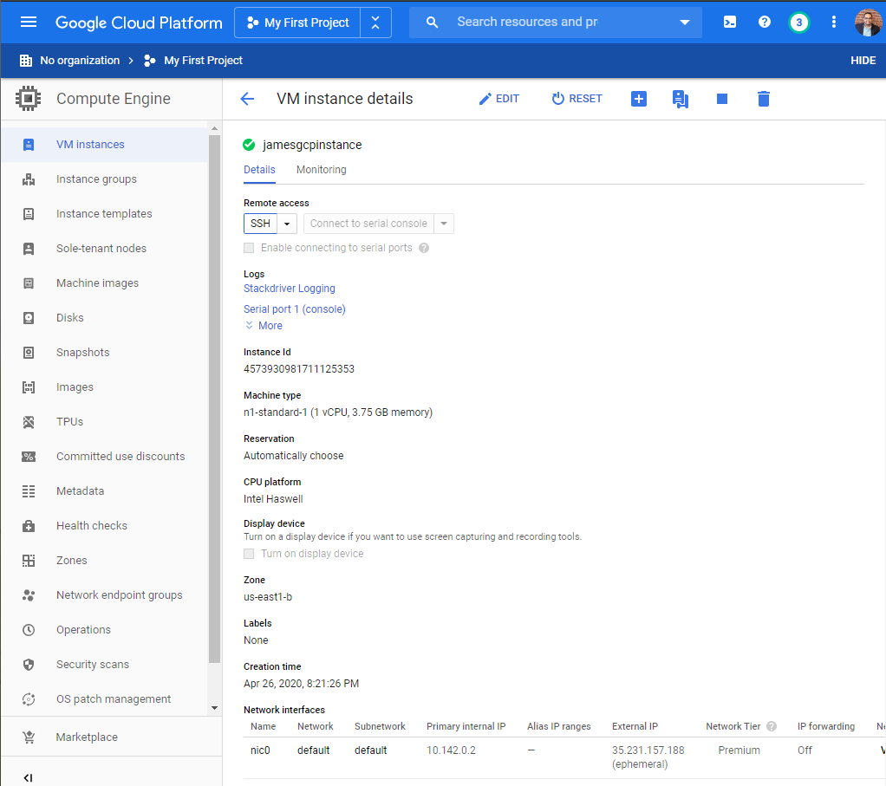
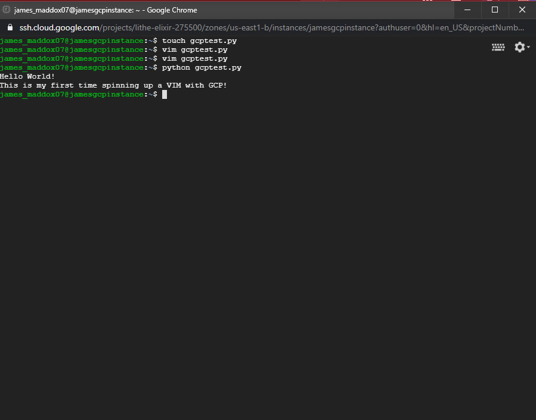
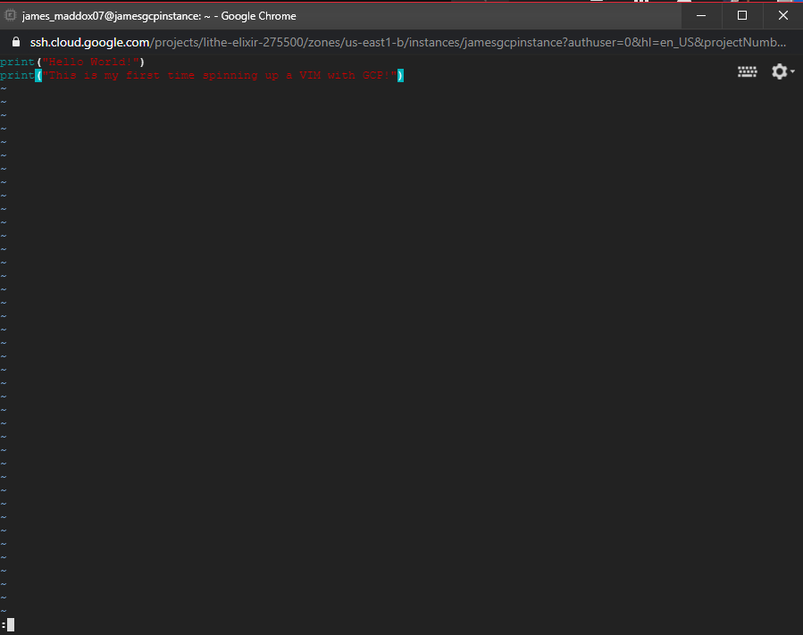

## Creating Linux VM in Google Cloud

Simple Linux VM creation using Google Cloud. I also SSH'ed into the instance and created a Hello World Python application.

Linux VM on GCP:  
  
 
SSH into instance to create Python 'Hello World' app:  
  
 
  
